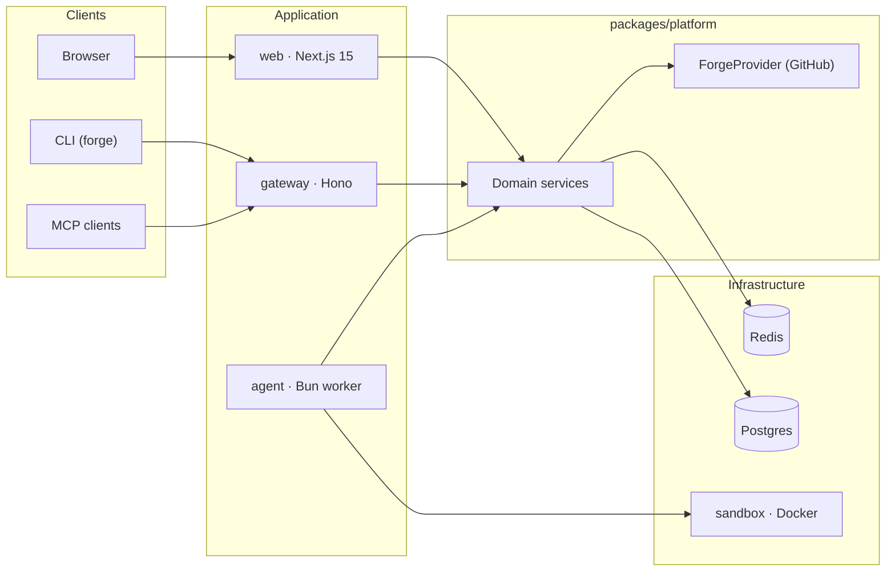

# render-coding-agents

An open-source AI coding agent platform. Connect your GitHub repos, describe what you want built, and let the agent write code, run tests, and open pull requests.

[](https://render.com/deploy?repo=https://github.com/render-oss/render-open-forge)

## How it works

1. **Sign in with GitHub** — OAuth connects your repos instantly.
2. **Start a session** — Pick a repo and branch. Tell the agent what to build.
3. **The agent works autonomously** — It reads your codebase, writes code, runs tests, creates branches, and opens PRs.
4. **Deploy to Render** — Preview environments spin up for every PR. Merge and ship to production.

## Architecture
 <PROJECT_NAME> 


| Component | What it does |
|---|---|
| **web** | Next.js 15 app: GitHub OAuth, sessions UI, chat streaming, repo browser |
| **gateway** | Hono headless API: REST, SSE, MCP — connect Claude Desktop, Cursor, or any MCP client |
| **agent** | Bun worker consuming jobs from Redis Streams, driving multi-step LLM execution with tools |
| **sandbox** | Isolated Docker environment for git operations, file I/O, and code execution |
| **cli** | Terminal client (`rca`) for managing sessions via the gateway API |

## Repo layout

```
apps/
  web/          Next.js 15: auth, chat UI, repo browser, streaming (port 4000)
  gateway/      Hono headless API: REST, SSE, MCP (port 4100)
  agent/        Agent worker: LLM tools, Redis Streams consumer
  sandbox/      Bun HTTP server in Docker: exec, file ops, git, snapshots
  cli/          CLI client ("rca"): config, chat, list, stop, pause, resume, stream

packages/
  platform/     Framework-agnostic service layer, ForgeProvider, queue, events, auth
  db/           Shared Drizzle ORM schema (Postgres 16)
  shared/       Error hierarchy, logger, API types, encryption utilities
```

## Quick start (local dev)

### 1. Clone and install

```bash
git clone https://github.com/render-oss/render-open-forge.git
cd render-open-forge
bun install
```

### 2. Configure environment

```bash
cp .env.example .env
```

Fill in the required values — see `.env.example` for guidance. At minimum you need:

- `GITHUB_OAUTH_CLIENT_ID` / `GITHUB_OAUTH_CLIENT_SECRET` — [create a GitHub OAuth App](https://github.com/settings/developers) with callback URL `http://localhost:4000/api/auth/callback/github`
- `AUTH_SECRET` — generate with `openssl rand -base64 32`
- `ANTHROPIC_API_KEY` — from your [Anthropic account](https://console.anthropic.com/)
- `ADMIN_EMAIL` / `ADMIN_PASSWORD` — for the auto-created admin account
- `SANDBOX_SHARED_SECRET` / `SANDBOX_SESSION_SECRET` — shared secrets for sandbox auth
- `ENCRYPTION_KEY` — generate with `openssl rand -hex 32`

### 3. Start infrastructure

```bash
bun run infra:up
```

Starts Postgres (port 5433), Redis (port 6380), and the sandbox (port 3001) via Docker Compose.

### 4. Push database schema

```bash
bun run db:push
```

### 5. Start the app

```bash
bun run dev
```

Next.js on `http://localhost:4000` and the agent worker start side by side. Sign in with GitHub or use your admin credentials.

### Useful commands

```bash
bun run infra:logs     # tail Docker service logs
bun run infra:down     # stop containers (data volumes preserved)
bun run db:studio      # Drizzle Studio on http://localhost:4983
bun run typecheck      # check all packages
bun run test           # run tests
bun run gateway        # start headless API gateway on http://localhost:4100
bun run worker         # start agent worker standalone
```

## CLI

The `rca` CLI lets you interact with sessions from the terminal via the gateway API.

```bash
cd apps/cli && bun run dev -- config set apiUrl http://localhost:4100
cd apps/cli && bun run dev -- config set apiKey <GATEWAY_API_SECRET>

rca chat "Fix the failing tests in src/utils.ts" --repo owner/repo
rca list --status running
rca stream <session-id>
rca stop <session-id>
rca pause <session-id>
rca resume <session-id>
```

## MCP integration

The gateway exposes an [MCP](https://modelcontextprotocol.io) endpoint at `/mcp` (Streamable HTTP). Connect Claude Desktop, Cursor, or any MCP client:

```json
{
  "mcpServers": {
    "forge": {
      "url": "https://<gateway-host>/mcp",
      "headers": {
        "Authorization": "Bearer <GATEWAY_API_SECRET>"
      }
    }
  }
}
```

See [`apps/gateway/README.md`](apps/gateway/README.md) for the full list of MCP tools and REST endpoints.

## Deploy to Render

The `render.yaml` blueprint provisions all services (web, agent, gateway, sandbox, Redis, Postgres). Fork this repo, then:

### 1. Create a GitHub OAuth App

Go to [GitHub Developer Settings](https://github.com/settings/developers) and create an OAuth App:
- **Homepage URL**: `https://<your-web-url>.onrender.com`
- **Authorization callback URL**: `https://<your-web-url>.onrender.com/api/auth/callback/github`

### 2. Deploy the blueprint

Go to [render.com/deploy](https://render.com/deploy?repo=https://github.com/render-oss/render-open-forge). Connect your fork. This creates all services, databases, and auto-generates secrets.

### 3. Set environment variables

After provisioning, set these on the **web** service:

| Variable | Value |
|---|---|
| `GITHUB_OAUTH_CLIENT_ID` | From your GitHub OAuth App |
| `GITHUB_OAUTH_CLIENT_SECRET` | From your GitHub OAuth App |
| `AUTH_URL` | `https://<web-url>.onrender.com` |
| `NEXT_PUBLIC_APP_URL` | Same as `AUTH_URL` |
| `ADMIN_EMAIL` | Email for the admin account |
| `ADMIN_PASSWORD` | Password for signing in |
| `ANTHROPIC_API_KEY` | Your Anthropic key |
| `RENDER_API_KEY` | Render Dashboard > Account Settings > API Keys |
| `SANDBOX_SERVICE_HOST` | Public URL of the sandbox service |

Set `ANTHROPIC_API_KEY` and `SANDBOX_SERVICE_HOST` on the **agent** service as well.

### 4. Push the database schema

```bash
DATABASE_URL="<external-connection-string>?sslmode=require" bun run db:push
```

Get the external connection string from the `db` database page in the Render Dashboard.

### 5. Redeploy and verify

Redeploy all services, then check:
- `https://<web-url>/api/health` should return `{"status":"healthy"}`
- Sign in with GitHub at `https://<web-url>`

## Agent Observability

The platform records structured events for every agent session — LLM calls, tool executions, and sandbox interactions. Events are stored in Postgres with configurable retention (default 30 days) and are queryable through both the web API and gateway.

### Configuration

All observability settings are optional. See `.env.example` for the full list:

| Variable | Default | Description |
|---|---|---|
| `OBSERVABILITY_EVENT_CAP` | `10000` | Max events per session before capping |
| `OBSERVABILITY_RETENTION_DAYS` | `30` | Days before events are purged |
| `OTEL_EXPORTER_OTLP_ENDPOINT` | — | Enable OTel export to an external collector |
| `OTEL_SERVICE_NAME` | `render-coding-agents-agent` | Service name in OTel spans |
| `OTEL_EXPORTER_OTLP_HEADERS` | — | Auth headers for OTLP endpoint |

### API Endpoints

- `GET /api/sessions/:id/events` — Paginated event timeline for a session
- `GET /api/observability/usage` — Aggregated token usage and cost breakdown

Both endpoints support `?from=`, `?to=` (ISO 8601), and `?groupBy=model|session` query parameters with Zod validation.

## Documentation

- [`apps/gateway/README.md`](apps/gateway/README.md) — Gateway REST API, MCP tools, SSE streams, webhook endpoints
- [`docs/backlog.md`](docs/backlog.md) — Planned features and technical debt
- [`docs/decisions/`](docs/decisions/) — Architecture Decision Records
